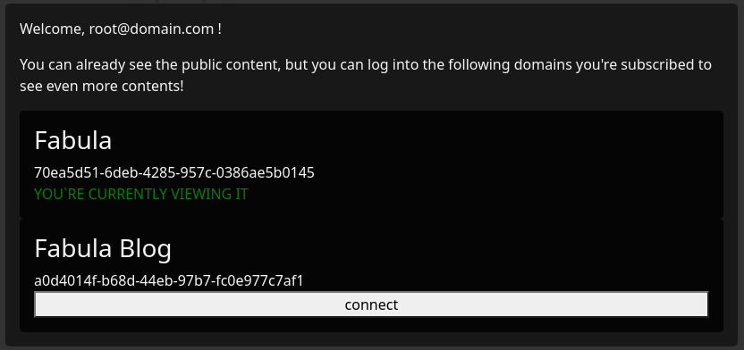

# FabulaUi

> THIS PROJECT IS A FRONT END FOR THE [Fabula](https://github.com/CaioSteinDAgostini/fabula) PROJECT

This project was generated with [Angular CLI](https://github.com/angular/angular-cli) version 13.3.1.

## What it is, what it is not

### What it is

- A sample project to document and share that I know type-script syntax.
- A project to show that I know how to navigate around Angular
  - organizing componentes, bindings, etc
 
### What it is not

- An example of application with great UX
- A complete application
- A beutifull front-end design

### What will you see?

#### login

The users will have been defined on the Starter class on the Fabula project (as it is now, the password is not verified since it is just for demo purposes)

### domain selection

Each instance of Fabula starts with a root domain, from which it is possible to create other domains. Documents are associated to domains, if you're not on the domain, you can't see them.
If you chance de selection, the application changes the visible documents (next sections of this readme).

### document listing

On a real application there would be a search form and pagination. But the concepts required to implement those are already covered in other parts of the project, so I did not implement that.

### document reading

The content of the document is a markdown which is compiled into html.

### document editing

It is possible do edit the document. In that case, the markdown is not compiled and it is viewed.. well... as mardown. You can save or cancel the edition.

#### document editing - background image and thumbnail

The gallery component loads and it is possible to select an image to be used as the document's background on the documen listing component.
I did not write the code to upload the images (only to retrieve it from the backend) and they have been loaded into the backend on the Starter class on the Fabula project.

## Development server

Run `ng serve` for a dev server. Navigate to `http://localhost:4200/`. The application will automatically reload if you change any of the source files.

## Code scaffolding

Run `ng generate component component-name` to generate a new component. You can also use `ng generate directive|pipe|service|class|guard|interface|enum|module`.

## Build

Run `ng build` to build the project. The build artifacts will be stored in the `dist/` directory.

## How to Dockerize it

```bash
docker build --tag=fabula-ui:latest .
docker run -p 8889:80 fabula-ui:latest

``
